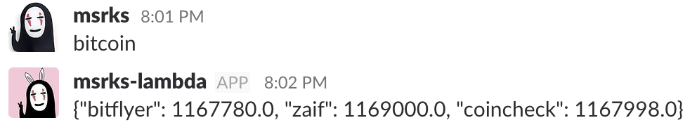

## slackbot in AWS Lambda



#### Dependencies:

```
chalice
requests
slackbot
slackweb
```

#### Features:

[Scheduled Handler](http://chalice.readthedocs.io/en/latest/api.html#Cron)

```
every 6 hours:
  -> notify BTC_JPY to Slack
```

REST API

```
/bitcoin
  POST -> return BTC_JPY  
```

#### Comment:

it is usefle to debug w/ ngrok and outbounding-webhook
